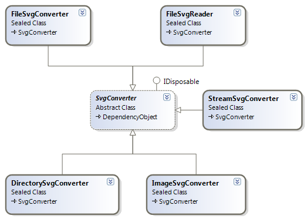
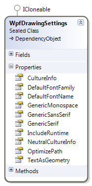
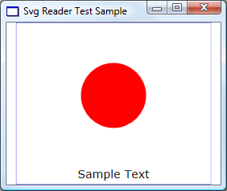
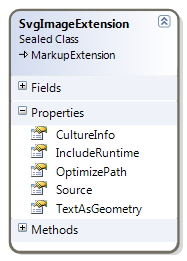
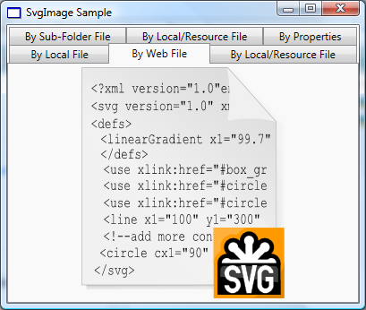
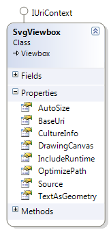
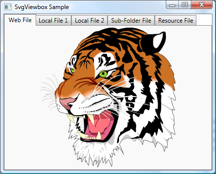
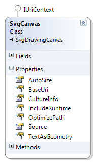
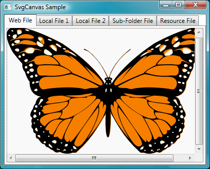

## 1 Getting Started
The SVG# Reloaded library provides three main uses of the SVG files in WPF applications. In this section, we will provide information to get you started with these uses.

* [Usage: Converters](Usage.md#Converters)
* [Usage: Type Converters](Usage.md#TypeConverters)
* [Usage: Controls and Viewers](Usage.md#Controls)
* [Codes: Illustrative Samples](Usage.md#Codes)


### 1.1 [](#Converters)Conversions
The SVG to WPF conversion is the main use of this SVG# Reloaded library currently. The other uses will be improved with time.
The following is a diagram showing all the available converters.



* **FileSvgConverter**: This converts the SVG file to the corresponding XAML file, which can be viewed in WPF application. The root object in the converted file is [DrawingGroup](https://docs.microsoft.com/en-us/dotnet/api/system.windows.media.drawinggroup).
* **FileSvgReader**: This converts the SVG file to [DrawingGroup](https://docs.microsoft.com/en-us/dotnet/api/system.windows.media.drawinggroup) and can optionally save the result to a file as XAML. 
* **ImageSvgConverter**: This converts the SVG file to static or bitmap image, which can be saved to a file.
* **StreamSvgConverter**: This converts the SVG file or stream to static or bitmap image, which can be saved to a stream. This can be used for ASP.NET pages.
* **DirectorySvgConverter**: This converts a directory (and optionally the sub-directories) of SVG files to XAML files in a specified directory, maintaining the original directory structure.

Now, the base class SvgConverter defines the following common properties:


* **DrawingSettings**: This is defined by a class, WpfDrawingSettings. See **Section 1.1.1** below for details.
* **SaveXaml**: Determines whether to save conversion output to XAML format.
* **SaveZaml**: Determines whether to save conversion output to ZAML format, which is a G-zip compression of the XAML format, and similar to the SVGZ (for SVG).
* **UseFrameXamlWriter**: Determines whether the use the .NET Framework version of the XAML writer when saving the output to the XAML format. The default is **false**, and a customized XAML writer is used.


#### 1.1.1 Drawing/Rendering Options
A class **WpfDrawingSettings** in the SharpVectors.Rendering.Wpf assembly provides the currently available drawing/rendering options for the conversion. The class is shown below:



All the properties of this class are well documented. The most important properties are
* **CultureInfo**: This is the culture information used for the text rendering, and it is passed to the [FormattedText](https://docs.microsoft.com/en-us/dotnet/api/system.windows.media.formattedtext) class. The default is the English culture.
* **IncludeRuntime**: This determines whether the application using the output of the conversion will link to the SharpVectors.Runtime.dll. The default is **true**, set this to **false** if you do not intend to use the runtime assembly.
* **TextAsGeometry**: This determines whether the texts are rendered as path geometry. The default is **false**. The vertical text does not currently support this option. Set this to **true** if do not want to use the runtime assembly, so that font path will not be included in the output.


#### 1.1.2 Illustrative Example
We will create a simple console application for illustration, using the following sample SVG file (named, **Test.svg**):
```xml
<?xml version="1.0" standalone="no"?>
<!DOCTYPE svg PUBLIC "-//W3C//DTD SVG 1.1//EN"
"http://www.w3.org/Graphics/SVG/1.1/DTD/svg11.dtd">
<svg width="6cm" height="5cm" viewBox="0 0 600 500"
xmlns="http://www.w3.org/2000/svg" version="1.1">
    <!-- Outline the drawing area with a blue line -->
    <rect x="1" y="1" width="598" height="498" 
          fill="none" stroke="blue"/>
    <circle cx="300" cy="225" r="100" fill="red"/>
    <text x="300" y="480" font-family="Verdana" 
          font-size="35" text-anchor="middle">
        Sample Text
    </text>
</svg>
```

1. Create a console .NET 4.x framework application, name it **FileSvgConverterSample**
2. Add the following WPF framework assemblies
	* WindowBase.dll
	* PresentationCore.dll
	* PresentationFramework.dll
3. Add the following SVG# Reloaded assemblies
	* SharpVectors.Converters.Wpf.dll
	* SharpVectors.Core.dll
	* SharpVectors.Css.dll
	* SharpVectors.Dom.dll
	* SharpVectors.Model.dll
	* SharpVectors.Rendering.Wpf.dll
	* SharpVectors.Runtime.Wpf.dll
4. Modify the generated code to the following:
	**For C#**
	```csharp
	using System;

	using SharpVectors.Converters;
	using SharpVectors.Renderers.Wpf;

	namespace FileSvgConverterSample
	{
	    class Program
	    {
		static void Main(string[]() args)
		{
		    // 1. Create conversion options
		    WpfDrawingSettings settings = new WpfDrawingSettings();
		    settings.IncludeRuntime = false;
		    settings.TextAsGeometry = true;

		    // 2. Select a file to be converted
		    string svgTestFile = "Test.svg";

		    // 3. Create a file converter
		    FileSvgConverter converter = new FileSvgConverter(settings);
		    // 4. Perform the conversion to XAML
		    converter.Convert(svgTestFile);
		}
	    }
	}
	```

	**For VB.NET**
	```vb
	Imports SharpVectors.Converters
	Imports SharpVectors.Renderers.Wpf

	Module MainModule

	    Sub Main()
		' 1. Create conversion options
		Dim settings As WpfDrawingSettings = New WpfDrawingSettings()
		settings.IncludeRuntime = False
		settings.TextAsGeometry = True

		' 2. Select a file to be converted
		Dim svgTestFile As String = "Test.svg"

		' 3. Create a file converter
		Dim converter As FileSvgConverter = New FileSvgConverter(settings)
		' 4. Perform the conversion to XAML
		converter.Convert(svgTestFile)
	    End Sub

	End Module
	```
5. Compile and run the program. An XAML file, **Test.xaml**, will be generated in the working directory. The output will look like this when viewed (this is the illustrative sample for FileSvgReader):

	

### [](#TypeConverters)1.2 WPF Extensions and Type Converters
These are WPF markup extensions or type converters for handling the SVG files in WPF applications.
Currently, the SVG# Reloaded provides one markup extension, **SvgImageExtension**, which converts an SVG source file to a [DrawingImage](https://docs.microsoft.com/en-us/dotnet/api/system.windows.media.drawingimage).



* As shown in the diagram above, all the rendering settings are available on this markup extension as properties.
* The main property here is the **SvgImageExtension.Source**, which is the path to the SVG file, and the file itself can be located in the following:
	* **Web/Internet**: The path in this case is the HTTP, FTP, etc scheme URI of the file.
	* **Local Computer Disk**: The path is the absolute or the relative URI to the SVG file.
	* **Resources**: The path is the [Microsoft Pack URI](https://docs.microsoft.com/en-us/dotnet/framework/wpf/app-development/pack-uris-in-wpf) of the SVG resource file.

For the illustration, we will create a simple WPF Application shown below, each image displayed is an SVG file in the WPF [Image Control](https://docs.microsoft.com/en-us/dotnet/api/system.windows.controls.image):



1. Create a .NET 3.5 WPF Application in C# or VB.NET, we will name it **SvgImageSample** and rename the main Window, **MainWindow**.
2. As above, add the following SVG# Reloaded assemblies
	* SharpVectors.Converters.Wpf.dll
	* SharpVectors.Core.dll
	* SharpVectors.Css.dll
	* SharpVectors.Dom.dll
	* SharpVectors.Model.dll
	* SharpVectors.Rendering.Wpf.dll
	* SharpVectors.Runtime.Wpf.dll
3. Modify the generated XAML code to the following (the C# or VB.NET codes are not modified):
	```xml
	<Window x:Class="SvgImageSample.MainWindow"
	    xmlns="http://schemas.microsoft.com/winfx/2006/xaml/presentation"
	    xmlns:x="http://schemas.microsoft.com/winfx/2006/xaml"
	    xmlns:svgc="http://sharpvectors.codeplex.com/svgc/"
	    xmlns:sys="clr-namespace:System;assembly=mscorlib"
	    Title="SvgImage Sample" Height="346" Width="409" Background="White">
	    <Window.Resources>
		<ResourceDictionary> 
		    <sys:String x:Key="WebFile">
			http://upload.wikimedia.org/wikipedia/commons/c/c7/SVG.svg
		    </sys:String>
		</ResourceDictionary>
	    </Window.Resources>
	    <DockPanel>
		<TabControl SelectedIndex="0" OverridesDefaultStyle="False">
		    <TabItem>
			<TabItem.Header>By Local File</TabItem.Header>
			<TabItem.Content>  
			    <!-- 1. Load local SVG file, using the constructor -->
			    <Image Source="{svgc:SvgImage ../Test1.svg}"/>        
			</TabItem.Content>
		    </TabItem>
		    <TabItem>
			<TabItem.Header>By Web File</TabItem.Header>
			<TabItem.Content>    
			    <!-- 2. Load Web SVG file, using the constructor. -->
			    <Image Source="{svgc:SvgImage {StaticResource WebFile}}"/>
			</TabItem.Content>
		    </TabItem>
		    <TabItem>
			<TabItem.Header>By Local/Resource File</TabItem.Header>
			<TabItem.Content>
			    <!-- 3. Load local, using the constructor and a property. -->
			    <Image Source="{svgc:SvgImage Test2.svg, TextAsGeometry=True}"/>
			</TabItem.Content>
		    </TabItem>
		    <TabItem>
			<TabItem.Header>By Sub-Folder File</TabItem.Header>
			<TabItem.Content>
			    <!-- 4. Load local, using constructor - works, but not 
			     recommended syntax, simply use /SubFolder/Test3.svg  -->
			    <Image Source="{svgc:SvgImage \\SubFolder\\Test3.svg}"/>
			</TabItem.Content>
		    </TabItem>
		    <TabItem>
			<TabItem.Header>By Local/Resource File</TabItem.Header>
			<TabItem.Content>
			    <!-- 5. Load resource, using the constructor. -->
			    <Image Source="{svgc:SvgImage /Resources/Test.svg}"/>
			</TabItem.Content>
		    </TabItem>
		    <TabItem>
			<TabItem.Header>By Properties</TabItem.Header>
			<TabItem.Content>
			    <!-- 6. Load resource, using property. -->
			    <Image Source="{svgc:SvgImage Source=/Resources/Test.svg}"/>
			</TabItem.Content>
		    </TabItem>
		</TabControl>
	    </DockPanel>
	</Window>
	```
	**NOTE**: As shown above, the local relative path and resource path are similar, and in this case the local directory is searched at runtime, and if no such file is found, it is assumed to be in the resource.
4. Compile and run the program. 


### [](#Controls)1.3 Controls and Viewers
These are WPF controls for directly viewing the SVG files or sources in the WPF applications.

#### 1.3.1 Viewbox Control - SvgViewbox
The **SvgViewbox** control is a WPF [Viewbox](https://docs.microsoft.com/en-us/dotnet/api/system.windows.controls.viewbox) derived control for viewing the SVG files in WPF applications, and allowing you to use all the Viewbox decorator properties. 



* It wraps a drawing canvas instead of image, so will support interactivity when added to future release of the drawing canvas.
* The main property is the **SvgViewbox.Source**, which is an [System.Uri](https://docs.microsoft.com/en-us/dotnet/api/system.uri) specifying the path to the SVG file.

For the illustration, we will create the following WPF sample application:



1. Create a WPF application project, named **SvgViewboxSample**, similar to the steps in **Section 1.2**.
2. Modify the XAML of the main window to the following
	```xml
	<Window x:Class="SvgViewboxSample.MainWindow"
	    xmlns="http://schemas.microsoft.com/winfx/2006/xaml/presentation"
	    xmlns:x="http://schemas.microsoft.com/winfx/2006/xaml"
	    xmlns:svgc="http://sharpvectors.codeplex.com/svgc/"
	    Title="SvgViewbox Sample" Height="346" Width="430" Background="White">
	    <DockPanel>
		<TabControl SelectedIndex="0" OverridesDefaultStyle="False">
		    <TabItem>
			<TabItem.Header>Web File</TabItem.Header>
			<TabItem.Content>
			    <!-- 1. Load Web SVG file -->
			    <svgc:SvgViewbox Source=
		    "http://croczilla.com/bits_and_pieces/svg/samples/tiger/tiger.svg"/>
			</TabItem.Content>
		    </TabItem>
		    <TabItem>
			<TabItem.Header>Local File 1</TabItem.Header>
			<TabItem.Content>
			    <!-- 2. Load local SVG file -->
			    <svgc:SvgViewbox Source="../Test1.svg"/>
			</TabItem.Content>
		    </TabItem>
		    <TabItem>
			<TabItem.Header>Local File 2</TabItem.Header>
			<TabItem.Content>
			    <!-- 3. Load local SVG file -->
			    <svgc:SvgViewbox Source="Test2.svg" TextAsGeometry="True"/>
			</TabItem.Content>
		    </TabItem>
		    <TabItem>
			<TabItem.Header>Sub-Folder File</TabItem.Header>
			<TabItem.Content>
			    <!-- 4. Load local sub-folder SVG file  -->
			    <svgc:SvgViewbox Source="\SubFolder\Test3.svg"/>
			</TabItem.Content>
		    </TabItem>
		    <TabItem>
			<TabItem.Header>Resource File</TabItem.Header>
			<TabItem.Content>
			    <!-- 5. Load Resource SVG file -->
			    <svgc:SvgViewbox Source="/Resources/Test.svg" Stretch="Uniform"/>
			</TabItem.Content>
		    </TabItem>
		</TabControl>
	    </DockPanel>
	</Window>
	```
3. Compile and run the program.

#### 1.3.2 Canvas Control - SvgCanvas
The **SvgCanvas** control is a WPF [Canvas](https://docs.microsoft.com/en-us/dotnet/api/system.windows.controls.canvas) derived control for viewing the SVG files in WPF applications, and allowing you to use all the canvas properties. 



* It derives from a drawing canvas instead of the generic canvas control, so will support interactivity when added to future release of the drawing canvas.
* The main property is the **SvgCanvas.Source**, which is an [System.Uri](https://docs.microsoft.com/en-us/dotnet/api/system.uri) specifying the path to the SVG file.

For the illustration, we will create the following WPF sample application:



1. Create a WPF application project, named **SvgCanvasSample**, similar to the steps in **Section 1.2**.
2. Modify the XAML of the main window to the following
	```xml
	<Window x:Class="SvgCanvasSample.MainWindow"
	    xmlns="http://schemas.microsoft.com/winfx/2006/xaml/presentation"
	    xmlns:x="http://schemas.microsoft.com/winfx/2006/xaml"
	    xmlns:svgc="http://sharpvectors.codeplex.com/svgc/"
	    Title="SvgCanvas Sample" Height="332" Width="413" Background="White">
	    <DockPanel>
		<TabControl SelectedIndex="0" OverridesDefaultStyle="False">
		    <TabItem>
			<TabItem.Header>Web File</TabItem.Header>
			<TabItem.Content>
			    <ScrollViewer CanContentScroll="False" 
			       VerticalScrollBarVisibility="Auto" 
			       HorizontalScrollBarVisibility="Auto">                        
				<!-- 1. Load Web SVG file -->
				<svgc:SvgCanvas Source=
		   "http://croczilla.com/bits_and_pieces/svg/samples/butterfly/butterfly.svg"/>
			    </ScrollViewer>
			</TabItem.Content>
		    </TabItem>
		    <TabItem>
			<TabItem.Header>Local File 1</TabItem.Header>
			<TabItem.Content>
			    <ScrollViewer CanContentScroll="False" 
			       VerticalScrollBarVisibility="Auto" 
			       HorizontalScrollBarVisibility="Auto">                        
				<!-- 2. Load local SVG file -->
				<svgc:SvgCanvas Source="../Test1.svg"/>
			    </ScrollViewer>
			</TabItem.Content>
		    </TabItem>
		    <TabItem>
			<TabItem.Header>Local File 2</TabItem.Header>
			<TabItem.Content>
			    <ScrollViewer CanContentScroll="False" 
			       VerticalScrollBarVisibility="Auto" 
			       HorizontalScrollBarVisibility="Auto">
				<!-- 3. Load local SVG file -->
				<svgc:SvgCanvas Source="Test2.svg"/>
			    </ScrollViewer>
			</TabItem.Content>
		    </TabItem>
		    <TabItem>
			<TabItem.Header>Sub-Folder File</TabItem.Header>
			<TabItem.Content>
			    <ScrollViewer CanContentScroll="False" 
			       VerticalScrollBarVisibility="Auto" 
			       HorizontalScrollBarVisibility="Auto">
				<!-- 4. Load local sub-folder SVG file  -->
				<svgc:SvgCanvas Source="\SubFolder\Test3.svg"/>
			    </ScrollViewer>
			</TabItem.Content>
		    </TabItem>
		    <TabItem>
			<TabItem.Header>Resource File</TabItem.Header>
			<TabItem.Content>
			    <ScrollViewer CanContentScroll="False" 
			       VerticalScrollBarVisibility="Auto" 
			       HorizontalScrollBarVisibility="Auto">
				<!-- 5. Load Resource SVG file -->
				<svgc:SvgCanvas Source="/Resources/Test.svg"/>
			    </ScrollViewer>
			</TabItem.Content>
		    </TabItem>
		</TabControl>
	    </DockPanel>
	</Window>
	```
3. Compile and run the program.

### [](#Codes)1.4 Sample Codes
Download the sample codes from the **TutorialSamples Folder** tab.

